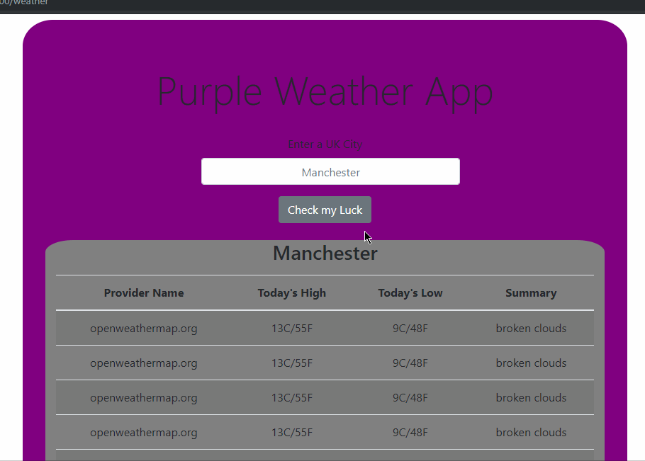

# purple_weather_app

## Welcome to purple weather app

This project uses symfony 4, composer, bootstrap 4 and openweathermap.org API.

**To clone and run project.**

cd into project folder ``/projects``

run ``cd project``

Use git clone
``git clone https://github.com/blips5/purple_weather_app.git``

cd into ``/purple_weather_app``

``cd purple_weather_app``

run command composer install

``composer install``

 run ``symfony server:start``

 goto local host ``http://127.0.0.1:8000/weather``

